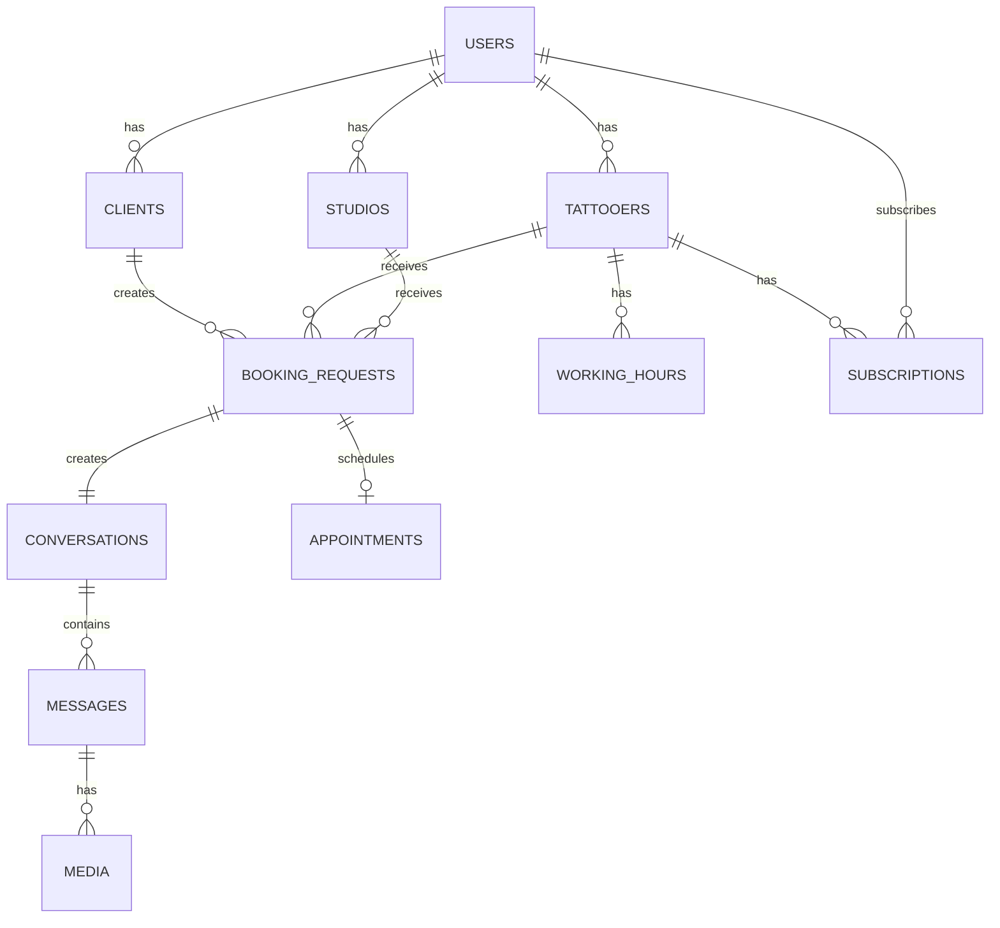

# 🏗️ Architecture Détaillée Ink&Pik

Documentation technique approfondie de l'architecture système Ink&Pik SaaS.

## 📋 Table des Matières

1. [Vue d'Ensemble](#vue-densemble)
2. [Services Métier](#services-métier)
3. [Events & Listeners](#events--listeners)
4. [Jobs & Queues](#jobs--queues)
5. [Observers & Hooks](#observers--hooks)
6. [Patterns Architecture](#patterns-architecture)
7. [Database Design](#database-design)

## 🎯 Vue d'Ensemble

### Architecture en Couches
```
┌─────────────────────────────────────────────────────────┐
│                    PRESENTATION                         │
│  ┌──────────┐  ┌──────────┐  ┌──────────┐             │
│  │ Livewire │  │  Blade   │  │   API    │             │
│  │Components│  │Templates │  │ Endpoints│             │
│  └──────────┘  └──────────┘  └──────────┘             │
└────────────────────┬────────────────────────────────────┘
                     │
┌────────────────────▼────────────────────────────────────┐
│                   APPLICATION                          │
│  ┌─────────────────┐  ┌─────────────────┐             │
│  │  Controllers    │  │   Services      │             │
│  │                 │  │                 │             │
│  │ - HTTP Layer    │  │ - Business Logic│             │
│  │ - Validation    │  │ - Orchestration │             │
│  │ - Authorization │  │ - External APIs │             │
│  └─────────────────┘  └─────────────────┘             │
└────────────────────┬────────────────────────────────────┘
                     │
┌────────────────────▼────────────────────────────────────┐
│                     DOMAIN                           │
│  ┌─────────────────┐  ┌─────────────────┐             │
│  │     Models      │  │    Policies     │             │
│  │                 │  │                 │             │
│  │ - Entities      │  │ - Authorization │             │
│  │ - Relations     │  │ - Permissions   │             │
│  │ - Business Rules│  │ - Access Control│             │
│  └─────────────────┘  └─────────────────┘             │
└────────────────────┬────────────────────────────────────┘
                     │
┌────────────────────▼────────────────────────────────────┐
│                 INFRASTRUCTURE                         │
│  ┌─────────────────┐  ┌─────────────────┐             │
│  │   Database      │  │ External Services│             │
│  │                 │  │                 │             │
│  │ - MySQL/PG      │  │ - Stripe        │             │
│  │ - Migrations    │  │ - Redis Cache   │             │
│  │ - Seeders       │  │ - Email Service │             │
│  └─────────────────┘  └─────────────────┘             │
└────────────────────────────────────────────────────────┘
```

## 🏭 Services Métier

### BookingRequestService

**Responsabilité** : Orchestration complète du workflow booking

```php
class BookingRequestService
{
    public function __construct(
        private NotificationService $notifications,
        private StripeService $stripe,
        private MediaService $media,
        private CacheService $cache
    ) {}

    // Acceptation demande
    public function accept(BookingRequest $booking, array $data): BookingRequest
    {
        return DB::transaction(function () use ($booking, $data) {
            // 1. Mise à jour statut
            $booking->update([
                'status' => BookingRequest::STATUS_ACCEPTED,
                'accepted_at' => now(),
                'estimated_total_price' => $data['estimated_total_price'],
                'total_deposit_amount' => $this->calculateDeposit($data),
                // ...
            ]);

            // 2. Création conversation
            $conversation = $this->createConversation($booking);

            // 3. Notifications
            $this->notifications->notifyBookingAccepted($booking);

            // 4. Cache invalidation
            $this->cache->invalidateTattooerStats($booking->bookable);

            // 5. Event dispatch
            BookingAccepted::dispatch($booking);

            return $booking->fresh(['conversation']);
        });
    }

    // Paiement acompte
    public function confirmDeposit(BookingRequest $booking, string $paymentIntentId): BookingRequest
    {
        // Validation Stripe
        $payment = $this->stripe->retrievePaymentIntent($paymentIntentId);
        
        if ($payment->amount !== $booking->total_deposit_amount * 100) {
            throw new PaymentException('Montant invalide');
        }

        return DB::transaction(function () use ($booking, $payment) {
            $booking->update([
                'status' => BookingRequest::STATUS_DEPOSIT_PAID,
                'deposit_paid_at' => now(),
                'stripe_payment_intent_id' => $payment->id,
            ]);

            $booking->conversation->update([
                'expiry_type' => 'permanent',
                'deposit_deadline_at' => null,
            ]);

            DepositConfirmed::dispatch($booking);

            return $booking->fresh();
        });
    }

    // Envoi design
    public function sendDesign(BookingRequest $booking, array $images, string $message): void
    {
        // Vérification limites plan
        if (!$booking->bookable->canSendMoreDesigns()) {
            throw new DesignLimitException('Limite designs atteinte');
        }

        DB::transaction(function () use ($booking, $images, $message) {
            // Upload images
            $mediaItems = $this->media->uploadDesignImages($booking, $images);

            // Création message design
            $designMessage = Message::create([
                'conversation_id' => $booking->conversation->id,
                'sender_id' => $booking->bookable->user_id,
                'sender_type' => get_class($booking->bookable),
                'content' => $message,
                'is_design_version' => true,
                'design_version_number' => $booking->design_versions_used + 1,
            ]);

            // Attach media
            foreach ($mediaItems as $media) {
                $designMessage->attachMedia($media, 'design_images');
            }

            // Mise à jour compteur
            $booking->increment('design_versions_used');
            $booking->update(['status' => BookingRequest::STATUS_DESIGN_SENT]);

            DesignSent::dispatch($booking, $designMessage);
        });
    }
}
```

### TattooerStatsService

**Responsabilité** : Calculs et mise en cache des statistiques

```php
class TattooerStatsService
{
    public function getDashboardStats(Tattooer $tattooer): array
    {
        return Cache::remember(
            "tattooer_stats_{$tattooer->id}",
            3600,
            fn() => $this->calculateStats($tattooer)
        );
    }

    private function calculateStats(Tattooer $tattooer): array
    {
        $baseQuery = BookingRequest::where('bookable_id', $tattooer->id)
            ->where('bookable_type', Tattooer::class);

        return [
            'completed_projects' => $baseQuery->clone()
                ->where('status', BookingRequest::STATUS_CONFIRMED)
                ->count(),
            
            'active_projects' => $baseQuery->clone()
                ->whereIn('status', [
                    BookingRequest::STATUS_ACCEPTED,
                    BookingRequest::STATUS_AWAITING_DEPOSIT,
                    BookingRequest::STATUS_DEPOSIT_PAID,
                    BookingRequest::STATUS_DESIGN_SENT
                ])
                ->count(),
            
            'monthly_revenue' => $this->getMonthlyRevenue($tattooer),
            'acceptance_rate' => $this->getAcceptanceRate($tattooer),
            'average_response_time' => $this->getAverageResponseTime($tattooer),
        ];
    }

    public function invalidateStats(Tattooer $tattooer): void
    {
        Cache::forget("tattooer_stats_{$tattooer->id}");
        
        // Invalidation tags si utilisé
        Cache::tags(['tattooer_stats', "tattooer_{$tattooer->id}"])->flush();
    }
}
```

### NotificationService

**Responsabilité** : Centralisation envoi notifications

```php
class NotificationService
{
    public function notifyBookingAccepted(BookingRequest $booking): void
    {
        // Email client
        Mail::to($booking->client->user->email)
            ->queue(new BookingAcceptedNotification($booking));

        // Notification in-app
        $booking->client->user->notify(new BookingAccepted($booking));

        // SMS (optionnel)
        if ($booking->client->user->sms_notifications_enabled) {
            $this->smsService->send(
                $booking->client->user->phone,
                "Votre demande a été acceptée par {$booking->bookable->name}"
            );
        }
    }

    public function sendExpirationWarning(Conversation $conversation): void
    {
        $participants = $conversation->participants;
        
        foreach ($participants as $participant) {
            $participant->notify(new ConversationExpiringSoon($conversation));
        }
    }
}
```

## 📡 Events & Listeners

### Events Principaux

```php
// Booking Events
BookingCreated::class
BookingAccepted::class
BookingRejected::class
DepositConfirmed::class
DesignSent::class
AppointmentConfirmed::class
BookingCancelled::class

// Conversation Events
ConversationCreated::class
MessageSent::class
ConversationExpired::class
ConversationArchived::class

// Payment Events
PaymentSucceeded::class
PaymentFailed::class
SubscriptionCreated::class
SubscriptionCancelled::class
```

### Listeners Configuration

**EventServiceProvider** :
```php
protected $listen = [
    BookingAccepted::class => [
        SendBookingNotification::class,
        UpdateTattooerStats::class,
        CreateConversation::class,
    ],
    
    DepositConfirmed::class => [
        UpdateBookingStatus::class,
        MakeConversationPermanent::class,
        SendDepositReceipt::class,
    ],
    
    DesignSent::class => [
        NotifyClientNewDesign::class,
        UpdateDesignVersionCount::class,
        LogDesignActivity::class,
    ],
];
```

### Event Example

```php
class BookingAccepted
{
    public function __construct(
        public BookingRequest $booking,
        public array $acceptanceData
    ) {}

    public function broadcastOn()
    {
        return new PrivateChannel('booking.' . $this->booking->id);
    }
}
```

## ⚙️ Jobs & Queues

### Queue Configuration

**config/queues.php** :
```php
'connections' => [
    'redis' => [
        'driver' => 'redis',
        'connection' => 'default',
        'queue' => env('REDIS_QUEUE', 'default'),
    ],
],

'failed' => [
    'driver' => 'database-uuids',
    'table' => 'failed_jobs',
],
```

### Jobs Types

#### 1. **Async Processing**

```php
class ProcessBookingRequest implements ShouldQueue
{
    use Dispatchable, InteractsWithQueue, Queueable, SerializesModels;

    public int $tries = 3;
    public int $backoff = [60, 300, 900]; // 1min, 5min, 15min

    public function __construct(public BookingRequest $booking) {}

    public function handle(BookingRequestService $service): void
    {
        $service->processAsync($this->booking);
    }

    public function failed(Throwable $exception): void
    {
        Log::error('Booking processing failed', [
            'booking_id' => $this->booking->id,
            'error' => $exception->getMessage(),
        ]);
    }
}
```

#### 2. **Scheduled Jobs**

```php
class CheckConversationExpirations implements ShouldQueue
{
    use Dispatchable, InteractsWithQueue, Queueable, SerializesModels;

    public function handle(): void
    {
        Conversation::where('expiry_type', 'deposit_pending')
            ->where('deposit_deadline_at', '<', now())
            ->where('is_expired', false)
            ->chunk(100, function ($conversations) {
                foreach ($conversations as $conversation) {
                    $conversation->markAsExpired();
                    ConversationExpired::dispatch($conversation);
                }
            });
    }
}
```

#### 3. **External API Calls**

```php
class SyncStripeAccount implements ShouldQueue
{
    use Dispatchable, InteractsWithQueue, Queueable, SerializesModels;

    public function __construct(public Tattooer $tattooer) {}

    public function handle(StripeService $stripe): void
    {
        try {
            $account = $stripe->retrieveAccount($this->tattooer->stripe_account_id);
            $this->tattooer->updateStripeStatus($account);
        } catch (ApiErrorException $e) {
            $this->release(300); // Retry in 5 minutes
        }
    }
}
```

### Queue Workers Configuration

**Supervisor** :
```ini
[program:inkpik-queue]
process_name=%(program_name)s_%(process_num)02d
command=php /var/www/inkpik/artisan queue:work --sleep=3 --tries=3 --max-time=3600
autostart=true
autorestart=true
stopasgroup=true
killasgroup=true
user=www-data
numprocs=4
redirect_stderr=true
stdout_logfile=/var/log/supervisor/inkpik-queue.log
stopwaitsecs=3600
```

## 👁️ Observers & Hooks

### Model Observers

**BookingRequestObserver** :
```php
class BookingRequestObserver
{
    public function created(BookingRequest $booking): void
    {
        // Cache invalidation
        Cache::tags(['marketplace', 'stats'])->flush();
        
        // Notifications admin
        if (app()->environment('production')) {
            AdminNotification::route('booking.new', $booking->id)
                ->notify("Nouvelle demande: {$booking->description}");
        }
    }

    public function updated(BookingRequest $booking): void
    {
        // Track status changes
        if ($booking->wasChanged('status')) {
            StatusChanged::dispatch($booking, $booking->getOriginal('status'));
        }

        // Auto-cleanup conversations
        if ($booking->status === BookingRequest::STATUS_CONFIRMED) {
            $booking->conversation->schedulePostAppointmentCleanup();
        }
    }

    public function deleted(BookingRequest $booking): void
    {
        // Cleanup related data
        $booking->media()->delete();
        $booking->conversation()->delete();
    }
}
```

### Trait Hooks

**HasWorkingHours Trait** :
```php
trait HasWorkingHours
{
    public static function bootHasWorkingHours(): void
    {
        static::updated(function ($model) {
            if ($model->wasChanged(['open_time', 'close_time', 'is_closed'])) {
                Cache::forget("working_hours_{$model->id}");
                AvailabilityUpdated::dispatch($model);
            }
        });
    }

    // Méthodes du trait...
}
```

## 🎨 Patterns Architecture

### 1. **Repository Pattern (Optionnel)**

```php
interface BookingRequestRepositoryInterface
{
    public function findById(int $id): ?BookingRequest;
    public function findByStatus(string $status): Collection;
    public function create(array $data): BookingRequest;
}

class EloquentBookingRequestRepository implements BookingRequestRepositoryInterface
{
    public function findById(int $id): ?BookingRequest
    {
        return BookingRequest::find($id);
    }

    public function findByStatus(string $status): Collection
    {
        return BookingRequest::where('status', $status)->get();
    }

    public function create(array $data): BookingRequest
    {
        return BookingRequest::create($data);
    }
}
```

### 2. **Strategy Pattern**

```php
interface PaymentStrategyInterface
{
    public function process(BookingRequest $booking): PaymentResult;
}

class StripePaymentStrategy implements PaymentStrategyInterface
{
    public function process(BookingRequest $booking): PaymentResult
    {
        // Stripe-specific logic
    }
}

class PayPalPaymentStrategy implements PaymentStrategyInterface
{
    public function process(BookingRequest $booking): PaymentResult
    {
        // PayPal-specific logic
    }
}
```

### 3. **Factory Pattern**

```php
class NotificationFactory
{
    public static function create(string $type, array $data): NotificationInterface
    {
        return match ($type) {
            'email' => new EmailNotification($data),
            'sms' => new SMSNotification($data),
            'push' => new PushNotification($data),
            default => throw new InvalidArgumentException("Unknown notification type: {$type}")
        };
    }
}
```

### 4. **Decorator Pattern**

```php
class BookingRequestDecorator
{
    public function __construct(protected BookingRequest $booking) {}

    public function getFormattedPrice(): string
    {
        return number_format($this->booking->estimated_total_price, 2, ',', ' ') . ' €';
    }

    public function getStatusBadge(): string
    {
        return match ($this->booking->status) {
            'pending' => '<span class="badge-yellow">En attente</span>',
            'accepted' => '<span class="badge-green">Accepté</span>',
            default => '<span class="badge-gray">' . $this->booking->status . '</span>'
        };
    }
}
```

## 🗄️ Database Design

### Schema Relations



### Indexation Strategy

```php
// Booking Requests
Schema::table('booking_requests', function (Blueprint $table) {
    $table->index(['status', 'created_at']); // Dashboard queries
    $table->index(['bookable_type', 'bookable_id']); // Polymorphic queries
    $table->index(['client_id', 'status']); // Client dashboard
    $table->index('created_at'); // Timeline queries
});

// Conversations
Schema::table('conversations', function (Blueprint $table) {
    $table->index(['expiry_type', 'deposit_deadline_at']); // Expiration checks
    $table->index(['status', 'archived_at']); // Cleanup queries
});

// Messages
Schema::table('messages', function (Blueprint $table) {
    $table->index(['conversation_id', 'created_at']); // Conversation timeline
    $table->index(['sender_id', 'sender_type']); // Sender queries
    $table->index(['is_design_version', 'design_version_number']); // Design tracking
});
```

### Data Partitioning (Future)

```php
// Partitionnement par date pour les messages
Schema::create('messages_partitioned', function (Blueprint $table) {
    // Colonnes...
})->partitionBy('YEAR(created_at)');

// Partitionnement par statut pour les bookings
Schema::create('booking_requests_partitioned', function (Blueprint $table) {
    // Colonnes...
})->partitionBy('status');
```

## 🔄 Data Flow Examples

### 1. **Booking Creation Flow**

```
Client POST /booking-requests
    ↓
BookingRequestController@store()
    ↓
BookingRequest::create($validated)
    ↓
BookingRequestObserver::created()
    ↓
Cache::tags(['marketplace'])->flush()
    ↓
BookingCreated::dispatch($booking)
    ↓
[Listeners]
├── SendAdminNotification
├── UpdateMarketplaceCache
└── LogActivity
    ↓
Response 201 + Location
```

### 2. **Payment Processing Flow**

```
Client POST /confirm-deposit
    ↓
BookingRequestController@confirmDeposit()
    ↓
BookingRequestService@confirmDeposit()
    ↓
StripeService::verifyPayment()
    ↓
DB::transaction()
├── BookingRequest::update()
├── Conversation::update()
└── Payment::create()
    ↓
DepositConfirmed::dispatch($booking)
    ↓
[Listeners]
├── SendReceiptEmail
├── UpdateTattooerStats
├── NotifyTattooer
└── LogRevenue
    ↓
Cache::forget("tattooer_stats_{$tattooerId}")
    ↓
Response 200
```

## 📊 Monitoring & Observability

### Metrics Collection

```php
// Custom Metrics
class MetricsCollector
{
    public static function bookingCreated(): void
    {
        StatsD::increment('bookings.created');
        StatsD::gauge('bookings.pending', BookingRequest::where('status', 'pending')->count());
    }

    public static function paymentProcessed(float $amount): void
    {
        StatsD::increment('payments.processed');
        StatsD::histogram('payments.amount', $amount);
    }
}
```

### Health Checks

```php
// Health endpoint
class HealthCheckController
{
    public function __invoke(): JsonResponse
    {
        return response()->json([
            'status' => 'healthy',
            'timestamp' => now()->toISOString(),
            'services' => [
                'database' => $this->checkDatabase(),
                'redis' => $this->checkRedis(),
                'stripe' => $this->checkStripe(),
                'storage' => $this->checkStorage(),
            ],
        ]);
    }
}
```

Cette architecture est conçue pour évoluer avec l'application tout en maintenant une séparation claire des responsabilités et une haute maintenabilité.
